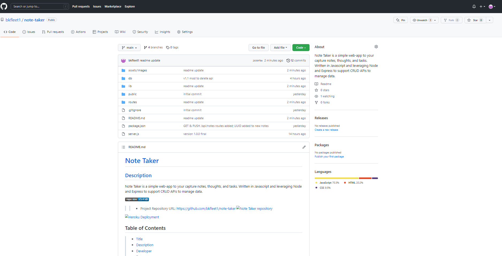
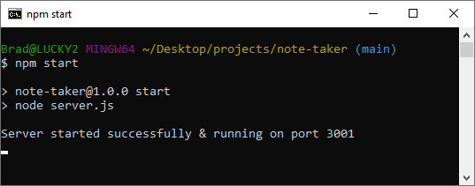
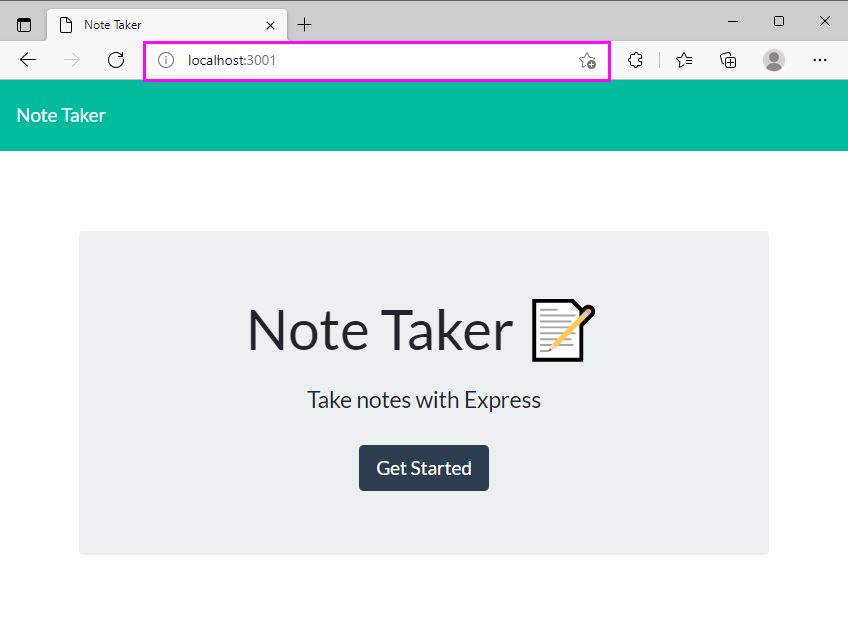
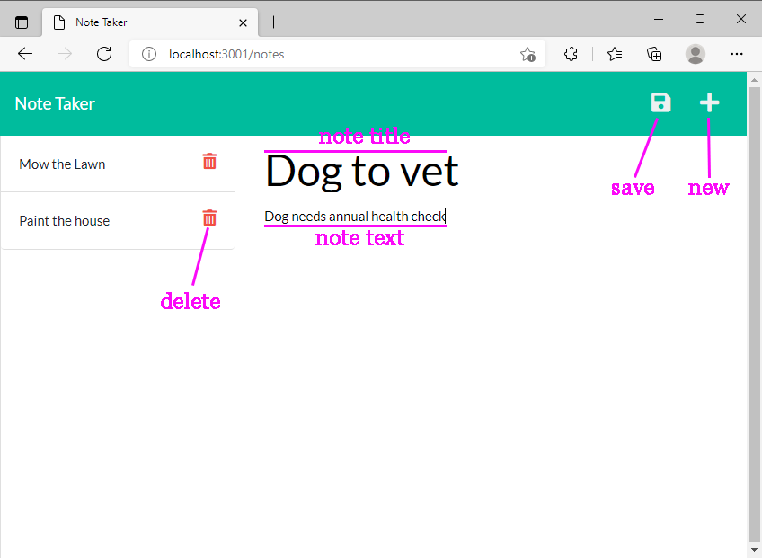

# [Note Taker](#title)

## [Description](#description)
Note Taker is a simple web-app to your capture notes, thoughts, and tasks. Written in Javascript and leveraging Node and Express to support CRUD APIs to manage data.

>> - Project Repository URL: https://github.com/bkfleet1/note-taker

## Table of Contents
> * [Title](#title)
> * [Description](#description)
> * [Developer](#developer)
> * [Resources](#resources)
> * [Installation](#installation) 
> * [Use Instructions](#usage)
> * [Tests](#tests)
> * [Questions](#questions)

## [Developer](#developer)
[Brad Kelley](mailto:bradkelleytech@gmail.com)

   
## [Resources](#resources)
The following resources were used in the development of this project.
> * Javascript
> * HTML5
> * CSS
> * Node.js
> * NPM
> * Express
> * Express Router
> * UUID

## [Installation](#installation)
The following steps are required to execute the Note Taker code.

> 1. Clone the repository located at: https://github.com/bkfleet1/note-taker.
> 2. Install Node.js. You can download the latest version of Node.js at https://nodejs.org/en/ ;
> 3. Open the project in a terminal application, such as git bash, and install NPM. To install npm, simply type "npm install" and press enter. Don't close your terminal application, we have a couple more items to install;
> 4. Next install Express, which is a package that provides a local web server to enable web-pages and APIs. To install Express simply type "npm install express" and press enter;
> 5. Finally you will need to install UUID, which is used to generate unique IDs that are assigned to each note. You can install UUIS by typing "npm install uuid" and press enter.

## [Use Instructions](#usage)
After the installation process, you will need to start the Express server. Just open the project in a terminal application, such as git bash, and type "npm start" and press enter. The image below illustrates the process of starting the Express server.

Now that the Express server is started, you can open a web browser and go to the URL: http://localhost:3001. You should see the following page on application launch.

You can then click on the Get Started button in the middle of the page to access the application's notes management screen shown below.

The application have very simple features to create a NEW note, SAVE a note, and DELETE a note.

## [Tests](#tests)
No testing available

## [Questions](#questions)
Please email [Brad Kelley](mailto:bradkelleytech@gmail.com) with any project questions.